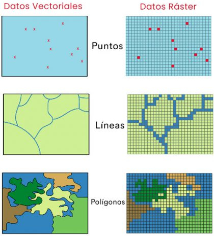
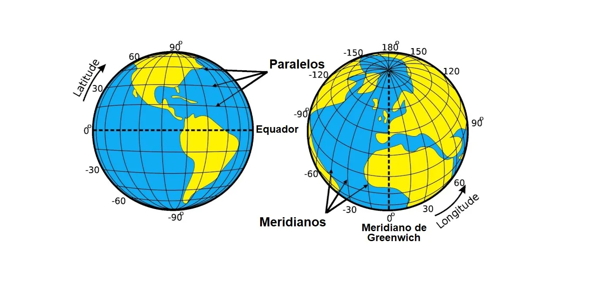
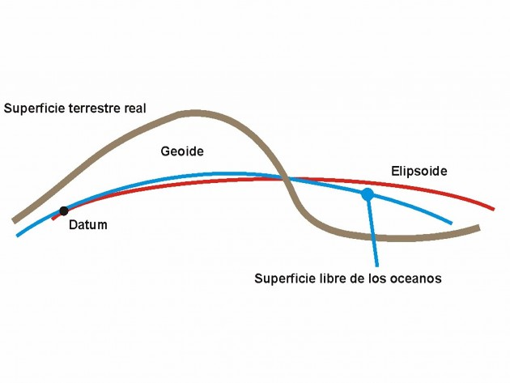
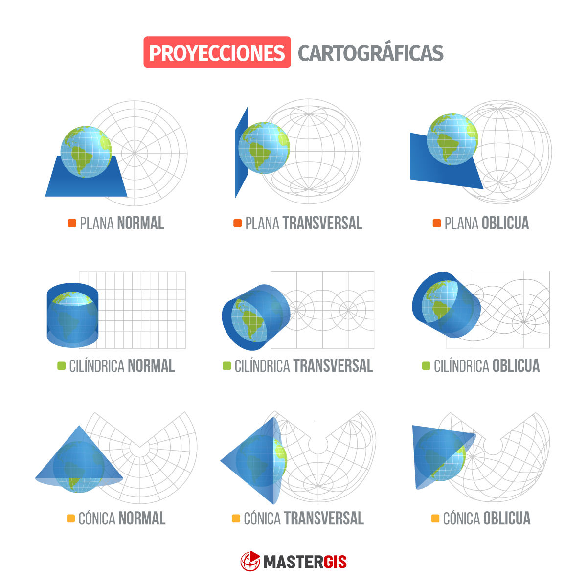
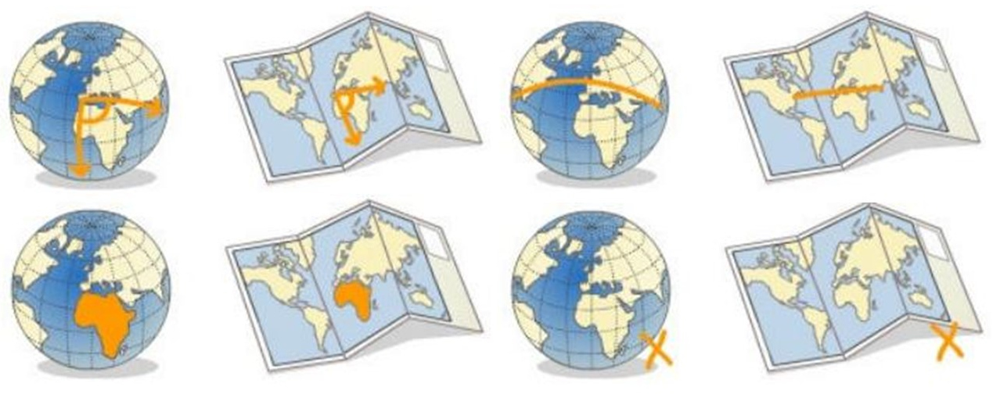

# Introducción a los datos espaciales

## ¿Qué son los datos espaciales?


## La misma información se puede representar de varias maneras

:::: {.columns}

::: {.column}
Algunos tipos de datos se ajustan mejor a ciertas formas de representación
:::

::: {.column}

:::

::::

## ¿Cómo se localiza la información?



## No parece fácil medir los ángulos ;)



Se calculan aproximaciones usando modelos de la Tierra (Datum)

## No es lo mismo saber donde ocurre algo que dibujarlo en un mapa

:::: {.columns}

::: {.column width="40%"}
Para ello es necesario proyectar una esfera sobre un plano
:::

::: {.column width="60%"}

:::

::::

## Cada proyección y cada datum genera mapas con propiedades diferentes

Conformes, equidistantes, equivalentes y afilácticas



# Manejando datos espaciales {background-color="aquamarine"}

## Vamos a usar el paquete `terra`

```{r}
#| echo: true

# install.packages("terra")
library(terra)
```

# Manejando datos vectoriales {background-color="aquamarine"}

## Podemos crear datos vectoriales desde cero

Los más sencillos de crear son los puntos

```{r}
#| echo: true
#| code-line-numbers: '1-2|3|4-5'

lon <- c(-116.7, -120.4, -116.7, -113.5, -115.5, -120.8, -119.5, -113.7, -113.7, -110.7) 
lat <- c(45.3, 42.6, 38.9, 42.1, 35.7, 38.9, 36.2, 39, 41.6, 36.9) 
lonlat <- cbind(lon, lat) 
pts <- vect(lonlat) 
pts
```

:::{.callout-warning}
Fijaros que el apartado "coord. ref." está vacío
:::

## Revisamos el tipo de datos

```{r}
#| echo: true

class(pts)
```

```{r}
#| echo: true

geom(pts)
```

## Veamos la distribución espacial de los datos

```{r}
#| echo: true

plot(pts)
```

## Definimos el sistema de referencia de coordenadas (CRS)

```{r}
#| echo: true

crdref <- "+proj=longlat +datum=WGS84"
pts <- vect(lonlat, crs = crdref)
pts
```

## Podemos comprobar el CRS de un objeto vectorial

```{r}
#| echo: true

crs(pts)
```

## La ubicación sola no es muy interesante...

Voy a simular valores de precipitación al azar (`sample`), un valor para cada punto

```{r}
#| echo: true
#| code-line-numbers: '1|2-3|4-5' 

precipvalue <- sample(1:100, 10)
df <- data.frame(ID = 1:nrow(lonlat), 
                 precip = precipvalue)
pts <- vect(lonlat, atts = df, crs = crdref)
pts
```

## Veamos las precipitaciones en su contexto espacial

```{r}
#| echo: true

plot(pts, "precip", type = "interval")
```

## Vamos a generar ahora un segundo conjunto de puntos...

```{r}
#| echo: true
#| code-line-numbers: '1-2|3-4'

lon2 <- c(-116.8, -114.2, -112.9, -111.9, -114.2, -115.4, -117.7)
lat2 <- c(41.3, 42.9, 42.4, 39.8, 37.6, 38.3, 37.6)
lonlat2 <- cbind(id = c(1,1,1,1,1,1,1), part = c(1,1,1,1,1,1,1), lon2, lat2)
lonlat2
```

## ... pero para crear datos de líneas...

```{r}
#| echo: true

lns <- vect(lonlat2, type = "lines", crs = crdref)
lns
```

```{r}
#| echo: true

plot(lns)
```

## ... o un datos de polígonos

```{r}
#| echo: true

pols <- vect(lonlat2, type = "polygons", crs = crdref)
pols
```

```{r}
#| echo: true

plot(pols)
```

## Lo más normal es usar datos generados con un SIG

Descargar datos de Internet (v.gr. [GADM](https://gadm.org)) y cargarlos desde el disco duro

```{r}
#| echo: true
#| eval: false

esp <- vect("data/gadm/gadm41_ESP_1.shp")
esp
```

## Lo más normal es usar datos generados con un SIG

Hay paquetes de R que dan acceso directo a datos vectoriales (v.gr. `geodata`)

```{r}
#| echo: true

# install.packages("geodata")
library(geodata)
esp <- gadm("ESP", level = 1, path = ".")
esp
```

## Veamos si se parece a lo que conocemos...

```{r}
#| echo: true

plot(esp)
```

## Estos datos se pueden guardar para no tener que volver a descargarlos

```{r}
#| echo: true
#| eval: false

writeVector(esp, "esp.shp", overwrite = TRUE)
```

## Comprobemos el CRS de alguno de nuestros datos

```{r}
#| echo: true

crs(esp)
```

## Se puede borrar el CRS del conjunto de datos

```{r}
#| echo: true

esp_sin_crs <- esp
crs(esp_sin_crs) <- ""
crs(esp_sin_crs)
```

## O se puede especificar a mano (estandar PROJ.4)

```{r}
#| echo: true

esp_falso_utm <- esp
crs(esp_falso_utm) <- "+proj=utm +zone=19 +south +datum=WGS84 +units=m +no_defs +type=crs"
crs(esp_falso_utm)
```

## O se puede especificar con los códigos [EPSG](https://epsg.io/)

```{r}
#| echo: true

esp_false_utm2 <- esp
crs(esp_false_utm2) <- "EPSG:32719"
crs(esp_false_utm2)
```

## Cambia el CRS pero no las coordenadas en si

```{r}
#| echo: true

par(mfrow = c(1, 4))
plot(esp)
plot(esp_sin_crs)
plot(esp_falso_utm)
plot(esp_false_utm2)
```

:::{.callout-note} 
Cambia la representación gráfica porque las unidades cambian entre CRS (grados o metros). Mientras los metros se representan igual en el eje horizontal y vertical, los grados geográficos no.
:::

## Para convertir coordenadas entre diferentes CRSs tenemos que proyectar los datos

```{r}
#| echo: true
#| code-line-numbers: '1|2|3-6'

esp_utm30n <- project(esp, "+proj=utm +zone=30 +north +datum=WGS84 +units=m +no_defs +type=crs")
esp_4326 <- project(esp, "EPSG:4326")
par(mfrow = c(1, 3))
plot(esp)
plot(esp_utm30n)
plot(esp_4326)
```

## También se puede filtrar la información para una o varias entidades de los datos

```{r}
#| echo: true

which(esp$NAME_1 == "Andalucía")
```

```{r}
#| echo: true
#| code-line-numbers: '1|2|3'

i <- which(esp$NAME_1 %in% c("Andalucía", "Región de Murcia"))
g <- esp[i,]
plot(g)
```

## Momento para practicar

Ejercicios de clase

Parte 1: Trabajando con datos vectoriales

# Manejando datos ráster {background-color="aquamarine"}

## Podemos crear datos ráster desde cero

```{r}
#| echo: true
#| code-line-numbers: '1-3|4|5'

r <- rast(ncol = 10, nrow = 10, 
          xmin = -150, xmax = -80, 
          ymin = 20, ymax = 60)
values(r) <- runif(ncell(r))
r
```

## Veamos que aspecto tienen

```{r}
#| echo: true

plot(r)
```

## Podemos operar con los datos ráster

```{r}
#| echo: true
#| code-line-numbers: '1|2'

r2 <- r * r
r3  <- sqrt(r)
```

:::{.callout-important}
Al operar con datos ráster, las operaciones se aplican sobre cada píxel individualmente. Por ello, sólo se pueden realizar operaciones con ráster que tienen el mismo área y el mismo tamaño de píxel. El resultado, por tanto, es un nuevo objeto ráster con las mismas características geográficas, pero cuyos píxeles tienen los valores resultantes de aplicar las funciones matemáticas.
:::

## Si trabajamos con muchas capas, mejor crear un objeto multicapa

```{r}
#| echo: true

stck <- c(r, r2, r3)
stck
```

## Veamos que aspecto tiene el objeto multicapa

```{r}
#| echo: true

plot(stck)
```

## También se pueden extraer capas de objetos multicapa

```{r}
#| echo: true

r2 <- stck[[2]]
r2
```

## Como antes, lo normal es cargar datos generados en SIG

Para ello podemos descargar datos de distintas fuentes (v.gr. [WorldClim](https://worldclim.org))

```{r}
#| echo: true

tavg <- rast("climate/tavg_esp.tif")
tavg
```

## Como antes, lo normal es cargar datos generados en SIG

... o podemos usar el paquete `geodata` para acceder directamente a esa información

```{r}
#| echo: true
#| eval: false

tavg <- worldclim_country("ESP", "tavg", path = ".")
tavg
```

## Veamos si se parece a lo que conocemos...

```{r}
#| echo: true

plot(tavg, range = c(-20, 30))
```

## También podemos guardar estos datos para no tener que volver a descargarlos

```{r}
#| echo: true
#| eval: false

writeRaster(tavg, "raster_tavg_esp.tif", overwrite = TRUE)
```

## Los datos ráster también se pueden proyectar

```{r}
#| echo: true
 
tavg_utm30n <- project(tavg, "EPSG:3042")
tavg_utm30n
```

## Ahora las coordenadas si aparecen "desplazadas"

```{r}
#| echo: true

par(mfrow = c(1, 2))
plot(tavg[[1]])
plot(tavg_utm30n[[1]])
```

:::{.callout-warning}
No hay una correspondencia exacta de píxeles. Lo veréis más claro si revisáis las diapositivas anteriores (39 y 43).
:::

## Para controlar el número de pixeles y su resolución podemos crear una "plantilla"

```{r}
#| echo: true

plantilla <- rast(tavg_utm30n)
res(plantilla) <- 800
plantilla
```

```{r}
#| echo: true

tavg_utm30n_plantilla <- project(tavg, plantilla)
tavg_utm30n_plantilla
```

## Veamos el resultado

```{r}
#| echo: true

par(mfrow = c(1, 3))
plot(tavg[[2]])
plot(tavg_utm30n[[2]])
plot(tavg_utm30n_plantilla[[2]])
```

## Momento de practicar por vuestra cuenta

Ejercicios de clase

Parte 2. Manejo de datos ráster

# Manipular datos espaciales {background-color="aquamarine"}

## Podemos dibujar los mapas en base a información de los atributos

```{r}
#| echo: true

plot(esp, "NAME_1")
```

## Podemos combinar información ráster y vectorial en el mismo gráfico

```{r}
#| echo: true

plot(tavg[[1]])
plot(esp, add = TRUE)
```

## También se puede extraer información de atributos para trabajar con ella

```{r}
#| echo: true

d <- as.data.frame(esp)
head(d)
```

## O puedo extraer la información de uno sólo de los atributos

```{r}
#| echo: true

esp$NAME_1
esp[, "NAME_1"]
```

:::{.callout-warning}
Notad que en este caso, las dos formas de extraer información no se comportan exactamente igual
:::

## También podemos extraer las características geográficas (espaciales)

```{r}
#| echo: true

g <- geom(esp_utm30n) 
head(g)
```

## Es posible incorporar información a nuestros datos vectoriales

```{r}
#| echo: true

perim(esp)
esp$perimetro <- perim(esp)
```

```{r}
#| echo: true

expanse(esp)
esp$area <- expanse(esp)
```

## ¿Qué pasa si quiero borrar una columna?

```{r}
#| echo: true

esp$area <- NULL
```

## A veces tenemos los datos en una tabla aparte

:::{.callout-note}
Me descargué datos del [censo poblacional del país](https://www.ine.es/dyngs/INEbase/operacion.htm?c=Estadistica_C&cid=1254736177095&menu=resultados&idp=1254735572981#_tabs-1254736195796)
:::

```{r}
#| echo: true

d <- openxlsx::read.xlsx("data/Censo_poblacional.xlsx",
                         sheet = 1)
d
```

## Podemos vincularla con los datos espaciales

Para vincularla necesitamos un campo en común

```{r}
#| echo: true
esp <- merge(esp, d, 
             by.x = "NAME_1", 
             by.y = "comunidad")
esp
```

## Veamos la población Española por provincias

```{r}
#| echo: true

plot(esp, "total", type = "continuous")
```

## A veces necesitamos fusionar las formas de varios polígonos (o líneas) en uno de mayor tamaño

```{r}
#| echo: true

esp <- aggregate(esp, by = "NAME_1") 
plot(esp, col = "yellow", lwd = 2, border = "red")
```

## Los objetos ráster también se pueden agregar

:::{.callout-note}
La agregación aquí trabaja a nivel de píxel, por lo que se usan para cambiar la resolución de los datos.
:::

```{r}
#| echo: true
#| code-line-numbers: '1|2-5'

tavg_20 <- aggregate(tavg, fact = 20, fun = "mean", na.rm = TRUE)
par(mfrow = c(1, 2))
plot(tavg[[1]])
plot(tavg_20[[1]])
```

## Podemos usar una capa vectorial como máscara para seleccionar objetos dentro de otra capa vectorial

```{r}
#| echo: true
#| code-line-numbers: '1|2|3|4-5' 
clip <- rast(ext = c(-6, -4, 37, 41), nrow = 2, ncol = 2)
values(clip) <- 1:4
names(clip) <- "Zona"
clip <- as.polygons(clip)
clip 
```

## Veamos que aspecto presentan las dos capas

```{r}
#| echo: true

plot(esp) 
plot(clip, add = TRUE, border = "blue", lwd = 5) 
```
 
## Hagamos la intersección y veamos el resultado

```{r}
#| echo: true

esp_clip <- intersect(esp, clip) 
plot(esp_clip)
```

## Los objetos ráster también se pueden cortar con un vectorial

```{r}
#| echo: true

tavg_esp <- mask(tavg, esp)
par(mfrow = c(1, 2))
plot(tavg[[1]])
plot(tavg_esp[[1]])
```

## Otras veces necesitamos combinar las formas de dos objetos vectoriales diferentes

```{r}
#| echo: true

u <- union(esp, clip)
plot(u, col = sample(rainbow(length(u))))
```

## Es muy útil extraer información de una capa vectorial en los puntos, líneas o polígonos de otra capa vectorial

Para ello creamos una capa de puntos cualquiera

```{r}
#| echo: true

pnts <- spatSample(esp, 100)
```

```{r}
#| echo: true

plot(esp)
plot(clip, add = TRUE, border = "cyan")
plot(pnts, add = TRUE, col = "red")
```

## Veamos los valores de las capas en los puntos

```{r}
#| echo: true

pnts_esp <- extract(esp, pnts)
head(pnts_esp)
```

```{r}
#| echo: true

pnts_clip <- extract(clip, pnts)
head(pnts_clip)
```

## Igual podemos hacer con respecto a los valores de los píxeles en cada punto de un vectorial

```{r}
#| echo: true

pnts_tavg <- extract(tavg, pnts)
head(pnts_tavg)
```

:::{.callout-warning}
Fijaros que extrae un valor de cada capa del ráster stack
:::

## También funciona con polígonos

```{r}
#| echo: true
#| code-line-numbers: '1|2'

prov_tavg <- extract(tavg, esp, fun = "mean", bind = TRUE, na.rm = TRUE)
plot(prov_tavg, "tavg_esp_1")
```

## Los objetos ráster se puede operar matemáticamente con ellos para generar estadísticos

`min`, `max`, `mean`, `prod`, `sum`, `median`, `cv`, `range`, `any` y `all`

```{r}
#| echo: true

min_tavg <- min(tavg)
plot(min_tavg)
```

## También hay multitud de funciones avanzadas propias de un SIG, tanto para vectoriales como ráster

`crop`, `trim`, `merge`, `disagg`, `resample`, `classify` o `cover`

El paquete `gdistance` ofrece análisis de distancias complejos (least cost path, etcétera)

## *Last but not least!* Se pueden transformar datos vectoriales en ráster...

```{r}
#| echo: true

esp_raster <- rasterize(esp, tavg, field = "NAME_1")
class(esp_raster)
plot(esp_raster)
```

## ... y viceversa

```{r}
#| echo: true

as.polygons(tavg[[1]])

```

## Hora de trabajar por vuestra cuenta...

Ejercicios de clase

Parte 3. Manipulación de datos ráster y vectoriales
